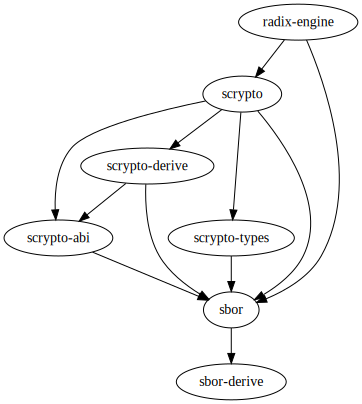

# Scrypto

[](https://github.com/radixdlt/radixdlt-scrypto/actions/workflows/ci.yml)

Language for building DeFi apps on Radix.

## Terminology

- **Package**: A collection of blueprints, built and published as a single unit.
- **Blueprint**: A template that describes the common behavior and state of its instances.
- **Component** An instance of a blueprint, which lives in the persistent state and may own resources.
- **Function**: A set of statements to perform a specific task.
- **Method**: A function attached to a component.
- **Resource**: A primitive state which can only be created once and moved.

## Installation

1. Install Rust
```
curl --proto '=https' --tlsv1.2 -sSf https://sh.rustup.rs | sh
```
2. Install WebAssembly toolchain
```
rustup target add wasm32-unknown-unknown
```
3. Install Radix Engine simulator
```
git clone git@github.com:radixdlt/radixdlt-scrypto.git
cd radixdlt-scrypto
cargo install --path ./simulator
```

## Getting Started

1. Create a new package by copying one from [the examples](./examples), and then build
```
cargo build --release
```
2. To create a new account, run
```
rev2 new-account
```
3. To publish your package, run
```
rev2 publish /path/to/your/package
```
4. To call a blueprint, run
```
rev2 call-blueprint <package_address> <blueprint> <function> <args>...
```
5. To call a component, run
```
rev2 call-component <component_address> <method> <args>...
```
6. For instructions on other commands, run
```
rev2 help
```

## Project Layout



- `sbor`: Scrypto Binary Object Representation (SBOR), the data format for Scrypto.
- `sbor-derive`: SBOR derives for Rust `struct` and `enum`.
- `scrypto`: Scrypto standard library.
- `scrypto-abi`: Scrypto JSON-exportable blueprint ABI.
- `scrypto-types`: Scrypto primitive types.
- `scrypto-derive`: Derives for creating and importing Scrypto blueprints.
- `radix-engine`: Radix Engine, the Scrypto execution layer.
