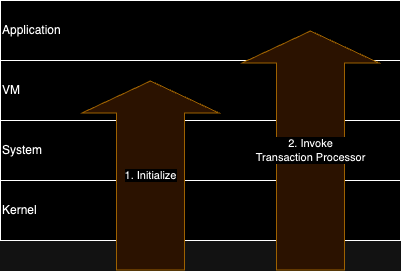

# Transaction Bootup

The bootup and initialization of a transaction consists of two steps:
1. Initialize Stack
2. Invoke Transaction Processor

## Initialize Stack

Before a transaction is executed, initialization of the Kernel/System/VM stack occurs. During this
initialization phase, configuration is loaded from the database and the state of each layer is
initialized.

| Layer  | Initialization Description                                                                                                                                                       |
|--------|----------------------------------------------------------------------------------------------------------------------------------------------------------------------------------|
| Kernel | Load Kernel version Check transaction references Create Initial Call Frame                                                                                                 |
| System | Load System module configurations Verify transaction has not been previously executed Verify transaction is valid within epoch bounds Initialize enabled System Modules |
| VM     | Load Scrypto VM version                                                                                                                                                          |

## Invoke Transaction Processor

Once the entire stack has been initialized along with the initial call frame, an invocation of a 
well-known blueprint, `TRANSACTION_PROCESSOR`, is made with the arguments specified in the transaction.
From this point forward, normal transaction execution occurs.
